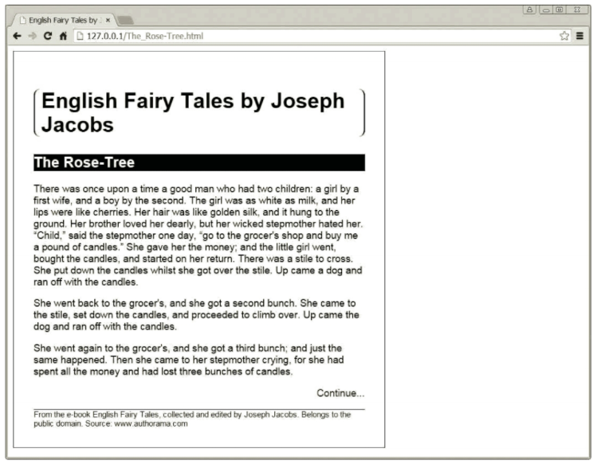

# Instructions  

You are provided with two files: `index.html` and `style.css`. The one has the skeleton of an HTML file and all of its content. It will render and be a complete page. Your job is to make that web page look like this:

Use any references and search engines you can to locate rules that will replicate the image. Work carefully and try to think about one element at a time until it all comes together. Refresh the rendered page often to see what changes do. Play around and experiment and see what works and what doesn't.

## Some Tips
* Pay extra close attention to how **borders** work in CSS.
* Set all of your font sizes yourself in css. Just get them close to the example.
* There are a couple things here that you might not be able to accomplish with what we've covered so far. Just do your best

Above all, if you're really stuck, contact the instructor and ask for help.

Here are the keywords from the chapter:

* CSS
* style sheet language
* declaration
* property
* value
* rule
* style
* inline CSS
* selector
* internal stylesheet
* external stylesheet
* &lt;style&gt;
* &lt;link&gt;
* data types
* RGB
* hexadecimal
* pixels
